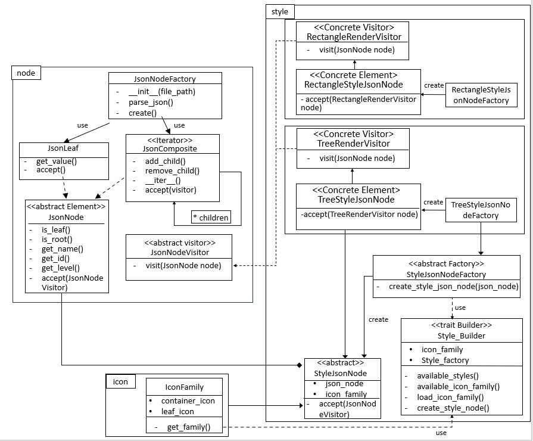

# 设计文档 迭代器模式+访问者模式

## 类图：




## 设计模式

### 1. 访问者模式

`node.py` 中 `JsonNode` 类为抽象被访问元素类；含有虚函数 `accept(JsonNodeVisitor)` 方法用于接受访问者类 `JsonNodeVisitor` 访问。新建 `JsonNodeVisitor` 作为抽象访问者类。含有虚函数 `visitor(JsonNode)` 用于访问元素。

`style` 中 `RectangleStyleJsonNode` 和 `TreeSyleJsonNode` 为具体被访问元素，继承自 `StyleJsonNode`。重写 `accept()` 方法接受访问者访问。

`style` 中 `RectangleRenderVisitor` 和 `TreeSyleRenderVisitor` 为具体访问者类，继承自 `JsonNodeVisitor`。重写 `visit()` 方法访问具体元素。完成不同风格的渲染节点任务。


### 2. 迭代器模式

在 `JsonComposite` 实现 `Iterator` 迭代器接口，用于管理每个 `Composite` 的孩子节点。同时实现 `iterate_nodes` 函数作为遍历节点的接口。


## 实现

### 1. 具体访问者和具体被访问元素

在 `RectangleStyle.py` 中 `RectangleStyledJSONNode` 的 `accept` 保留了原本的使用深度优先搜索方法渲染方法，同时添加了访问者模式实现渲染方法。

代码如下：

```py
def accept(self, method="iterator_visitor") -> None:
    if method == "dfs": # 使用 dfs 方法遍历
        self.json_node.dfs(lambda node: self.render(node))
    elif method == "iterator_visitor": # 使用迭代器 + 访问者模式方法
        visitor = RectangleRenderVisitor(self.icon_family, self.grid_width, self.finder_first_last)
        for node in self.iterate_nodes(self.json_node):
            node.accept(visitor)
```

同理在 `TreeStyle.py` 中 `TreeStyledJSONNode` 中的 `accept` 也实现了切换渲染方法的接口。

```py
def accept(self, method = "iterator_visitor"):
    if method == "origin":
        self.render_container('', '', self.json_node)
    elif method == "iterator_visitor": # 使用访问者模式方法
        visitor = TreeRenderVisitor(self.icon_family)
        self.json_node.accept(visitor)
```

### 2. 迭代器

```py
# 遍历节点
def iterate_nodes(self, node: JsonNode):
    yield node
    if not node.is_leaf():
        for child in node:
            yield from self.iterate_nodes(child)
```

## 结果：

处理以下 json 文件
```json
{
    "oranges": {
      "mandarin": {
        "clementine": null,
        "tangerine": "cheap & juicy!"
      }
    },
    "apples": {
      "gala": 23,
      "pink lady": null
    }
  }
  
```


可以看到结果仍然正确输出。

Github repo URL: `https://github.com/Louis3835/Funny-Json-Explorer.git`