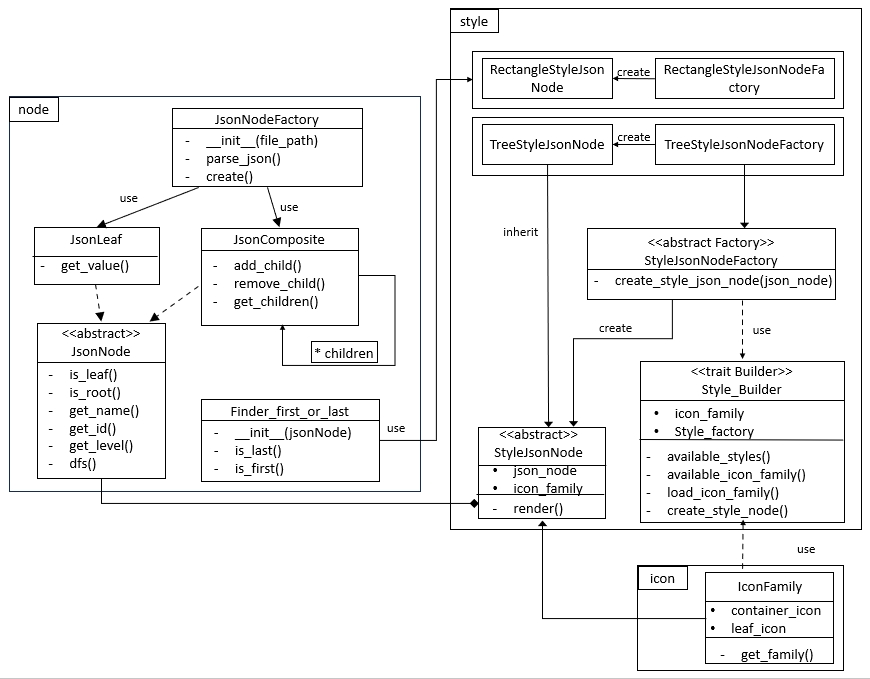

# 设计文档

## 类图：

## 设计模式

### 1. 抽象工厂

**主要用于不同风格的生产**。`StyleJsonNodeFactory` 为抽象工厂，`TreeStyleJsonNodeFactory` 和 `RectangleStyleJsonNodeFactory` 为生产产品的具体工厂类。

`StyleJsonNode` 为抽象产品类，`TreeStyleJsonNode` 和 `RectangleStyleJsnoNode` 为具体产品类，由具体工厂生产。

### 2. 工厂方法

#### 2.1 处理风格

`TreeStyleJsonNodeFactory` 和 `RectangleStyleJsonNodeFactory` 为工厂类，用 `create_style_json_node` 方法生成不同风格节点产品：`TreeStyleJsonNode` 和 `RectangleStyleJsnoNode`

#### 2.2 处理 json 节点

`JsonNodeFactory` 为工厂类，使用 `parse_json()` 方法加载解析json文件，用 `create()` 方法生产 `JsonNode` 节点处理 json 文件信息。

### 3. 建造者方法

`Style_builder` 为建造者，将 `StyleJsonNodeFactory` 风格工厂和 `iconFamily` 图标族组建起来，用于生产融合了多种图标族的 `StyleJsonNode`。

### 4. 组合模式

`JsonNode` 的设计使用组合模式，其中 `JsonNode` 为 `Component`，`JsonLeaf` 为叶子节点（`Leaf`），`JsonComposite` 为 `Composite`

