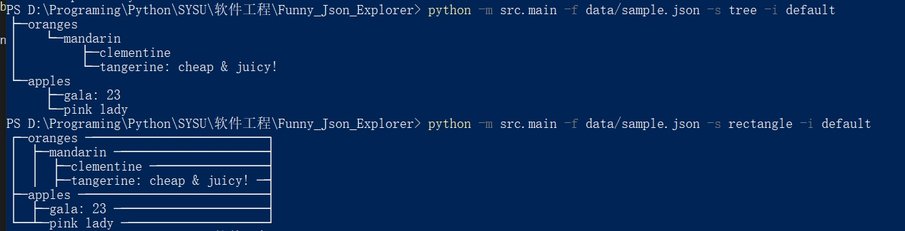
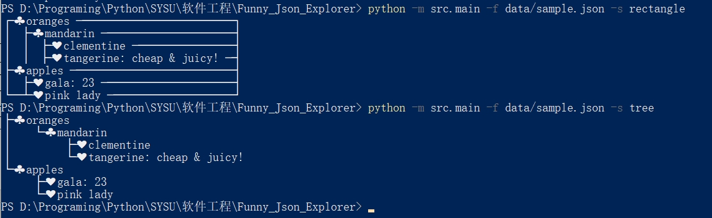

# Funny JSON Explorer

Funny JSON Explorer (FJE)，是一个JSON文件可视化的命令行界面小工具

Github repo URL: `https://github.com/Louis3835/Funny-Json-Explorer.git`


## 使用

进入 `Funny_Json_Explorer` 文件夹后，使用命令：
```shell
python -m src.main  -f <json file> -s <style> -i <icon family>
```

以下为完整命令说明：

```shell
usage: main.py [-h] -f FILE [-s STYLE] [-i ICON_FAMILY] [-c CONFIG] [-a]

Funny Json Explorer

options:
  -h, --help            show this help message and exit
  -f FILE, --file FILE  Json file path
  -s STYLE, --style STYLE
                        style
  -i ICON_FAMILY, --icon-family ICON_FAMILY
                        icon-family
  -c CONFIG, --config CONFIG
                        icon family file
  -a, --available       print available icon family and styles
```

## 测试

使用 `data/sample.json`:

```json
{
    "oranges": {
      "mandarin": {
        "clementine": null,
        "tangerine": "cheap & juicy!"
      }
    },
    "apples": {
      "gala": 23,
      "pink lady": null
    }
  }
  
```

结果如下：

默认图标族（树形和矩形）：中间节点icon：` ` 叶节点icon：` ` 


扑克图标族（树形和矩形）：中间节点icon：♣ 叶节点icon：♥



## 模块说明：

1. `Exception`: 定义异常类，用于捕获异常
2. `icon`: 图标族类，用于处理图标族的数据
3. `main`: 读取命令行参数，调用建造者获得 `Style_Builder`，加载图标族和风格种类，调用渲染。
4. `node`: 定义工厂类加载 json 文件，同时定义节点类处理 json 文件信息。
5. `style`: 用于不同风格的渲染
   1. `style`: 定义风格抽象工厂类和风格抽象产品类
   2. `Builder`: 定义建造者 `Style_Builder` ，组建不同的风格工厂和不同图标族
   3. `TreeSstyle`: 定义树形风格工厂和树形风格产品
   4. `RectangleStyle`: 定义矩形风格工厂和矩形风格产品